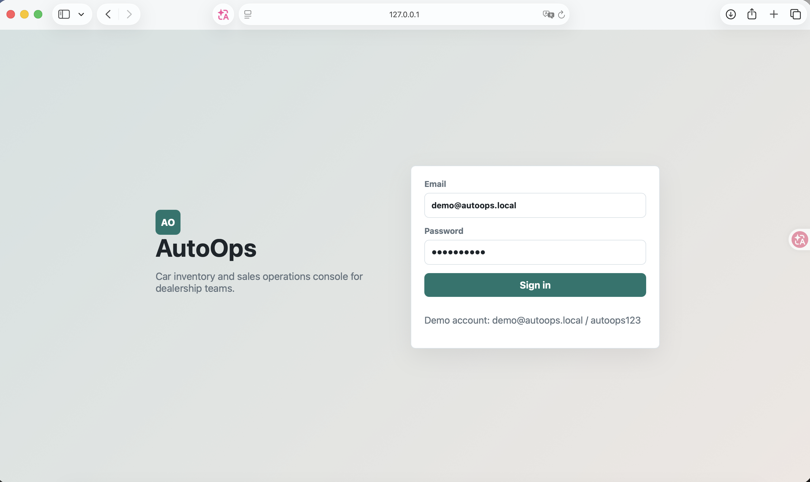
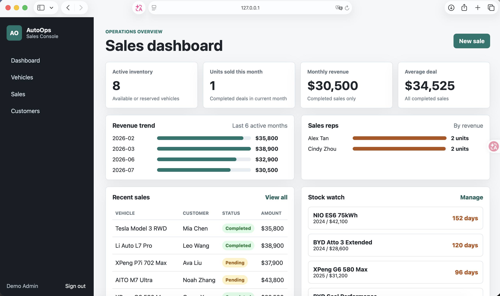
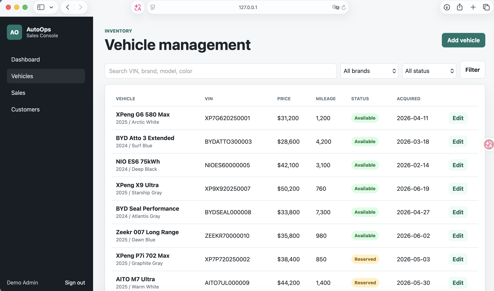
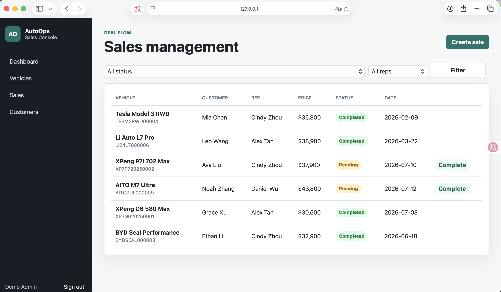

# AutoOps - Car Sales Operations Dashboard

AutoOps is a full-stack Flask demo for a dealership operations team. It turns a classroom-style car sales database idea into a runnable product demo with login, inventory management, sales workflow, customer records, an operations dashboard, and an AI Sales Analyst for natural-language operating questions.

This project uses mock data for demonstration purposes only. No real customer, sales, or company data is included.

## Live demo

- URL: https://autoops-xzto.onrender.com
- Email: `demo@autoops.local`
- Password: `autoops123`

## Demo account

- Email: `demo@autoops.local`
- Password: `autoops123`

## Screenshots

### Login



### Dashboard



### Vehicle management



### Sales management



## Features

- User login and protected internal pages
- Inventory list with search, brand filter, and status filter
- Add and edit vehicles with validation for VIN, year, price, mileage, and status
- Customer list, search, and new customer creation
- Sales records with pending/completed states
- Completing a sale automatically updates the vehicle inventory status
- Dashboard metrics for inventory, monthly units, monthly revenue, average deal size, monthly trend, rep ranking, recent deals, and stock aging
- AutoOps AI Sales Analyst with RAG-style database knowledge retrieval, safe NL2SQL generation, tool-calling workflow, query execution, result tables, bar charts, and generated business insights
- Multi-step diagnosis flow for questions such as sales decline analysis, combining revenue trend, inventory, pending pipeline, metric calculation, and report generation
- Seed data for realistic screenshots and quick demonstrations

## Tech stack

- Python 3
- Flask
- SQLite for local development
- Jinja templates
- HTML/CSS
- RAG-style documentation retrieval
- Rule-based NL2SQL templates
- Tool-calling style agent orchestration
- Gunicorn for production-style serving

## Project structure

```text
autoops/
├── app/
│   ├── routes/
│   ├── static/
│   ├── templates/
│   ├── analyst.py
│   ├── copilot.py
│   ├── __init__.py
│   └── db.py
├── database/
│   ├── schema.sql
│   └── seed.sql
├── database_docs/
│   ├── schema.md
│   ├── business_rules.md
│   ├── metric_definitions.md
│   └── examples.md
├── docs/
├── tests/
├── app.py
├── requirements.txt
├── .env.example
└── README.md
```

## Run locally

```bash
cd autoops
python3 -m venv .venv
source .venv/bin/activate
pip install -r requirements.txt
flask --app app.py run --debug
```

Open `http://127.0.0.1:5000` and sign in with the demo account.

If you already have Flask installed and do not want a virtual environment, this also works:

```bash
cd autoops
python3 app.py
```

## Deploy to Render

This repository includes `render.yaml`, so Render can detect the web service configuration automatically.

Manual settings:

- Build command: `pip install -r requirements.txt`
- Start command: `gunicorn wsgi:app`
- Environment variables:
  - `SECRET_KEY`: generated or any long random value
  - `AUTOOPS_DATABASE`: `/tmp/autoops.sqlite`

## Reset local data

Delete the generated SQLite database and restart the app:

```bash
rm instance/autoops.sqlite
python3 app.py
```

The app will recreate the schema and seed data automatically.

## Run tests

```bash
cd autoops
python3 -m unittest discover -s tests
```

## Product story

Dealership sales teams often manage inventory status, customer records, and sales updates across separate spreadsheets. AutoOps gives the team one internal console to search vehicles, create sales records, update deal status, and monitor operating metrics.

Core workflow:

```text
Sign in -> Review dashboard -> Search inventory -> Add or edit vehicle -> Create sale -> Complete sale -> Dashboard updates
```

AI Sales Analyst workflow:

```text
Business question
  -> retrieve schema docs, metric definitions, business rules, and SQL examples
  -> select intent or multi-step plan
  -> call read-only database tools
  -> calculate metrics
  -> generate chart data
  -> generate analyst report
```

The current implementation uses a deterministic local retrieval and planning layer so the live demo works without API keys. It is designed to be upgraded to LangChain, FAISS/Chroma, and an OpenAI/Qwen/DeepSeek model when a production LLM key is available.

## Independent work statement

This project can be presented as an independently rebuilt and extended full-stack demo inspired by a university database assignment. If you reuse any original group-project code later, keep that statement in the README and explain which parts you rebuilt yourself.

## Next improvements

- Replace SQLite with PostgreSQL for cloud deployment
- Add optional LangChain + FAISS/Chroma retrieval backend
- Add optional OpenAI/Qwen/DeepSeek LLM provider for free-form reasoning
- Add role-based permissions for manager and sales staff
- Add pagination for large inventory tables
- Add CSV import/export
- Add one-click PDF/CSV export for generated analyst reports
- Record a two-minute product walkthrough video
